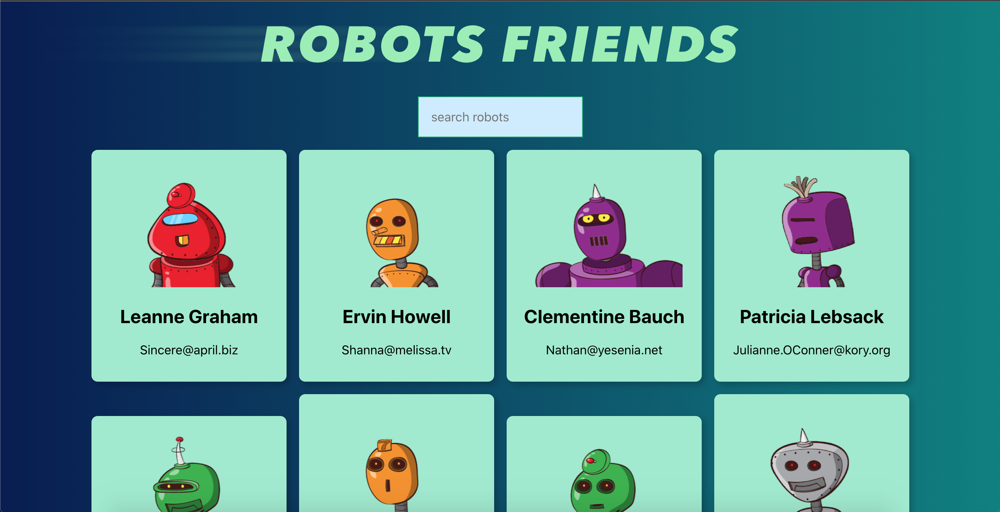

# robot-friends

Robot Friends is an app built with react &amp; react component. The app gives a friendly UI, easy to use and to look for a robot card.



## 💻 Getting Started

To get a local copy up and running, follow these steps.

### Setup

Clone this repository to your desired folder:

```sh
  cd my-folder
  git clone https://github.com/jeanbuhendwa/robot-friends
```

### Install

Install this project with:

```sh
  cd robot-friends
  npm install
```

### Usage

To run the project, execute the following command:

```sh
  npm start
```

### Run tests

To run tests, run the following command:

```sh
  npm run test
```

## 👥 Author

👤 **Jean Jacques Buhendwa**

- GitHub: [@jeanbuhendwa](https://github.com/jeanbuhendwa)
- Twitter: [@JeanjacqueI](https://twitter.com/JeanjacqueI)
- LinkedIn: [@in/johnbuhendwa/](https://www.linkedin.com/in/johnbuhendwa/)

## 🤝 Contributing <a name="contributing"></a>

Contributions, issues, and feature requests are welcome!

Feel free to check the [issues page](../../issues/).

## ⭐️ Show your support

If you like this project please leave a star.

## 📝 License <a name="license"></a>

This project is [MIT](./LICENSE) licensed.
